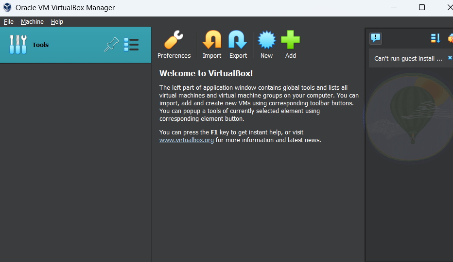
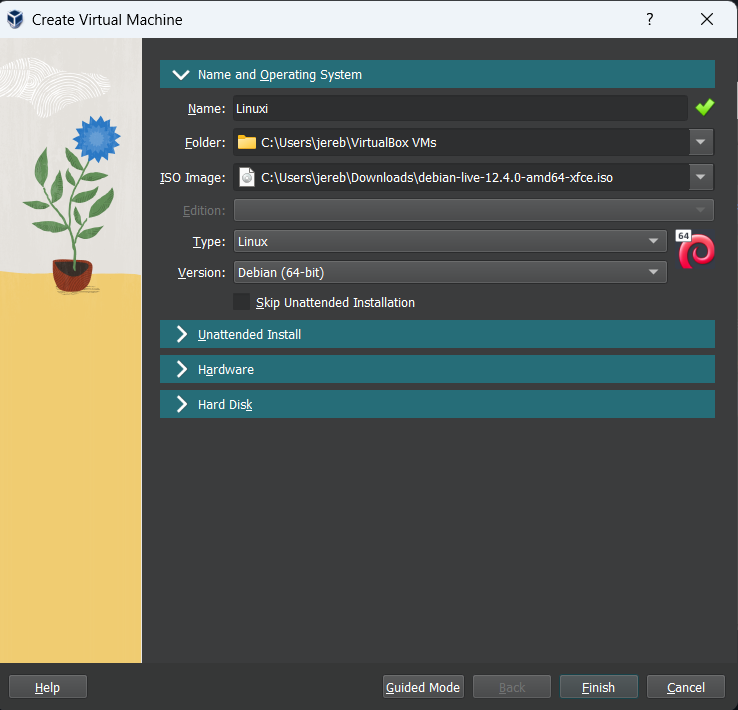
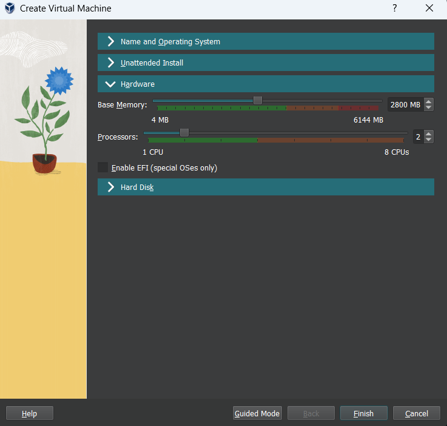
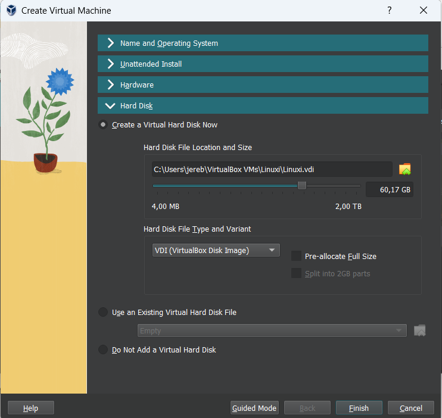
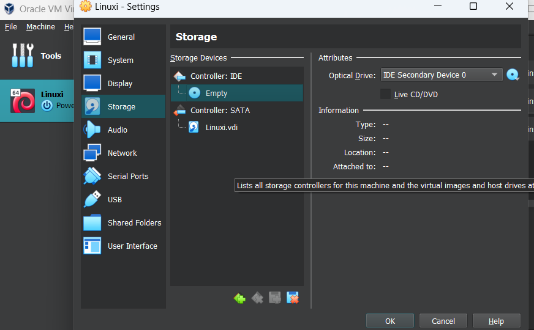
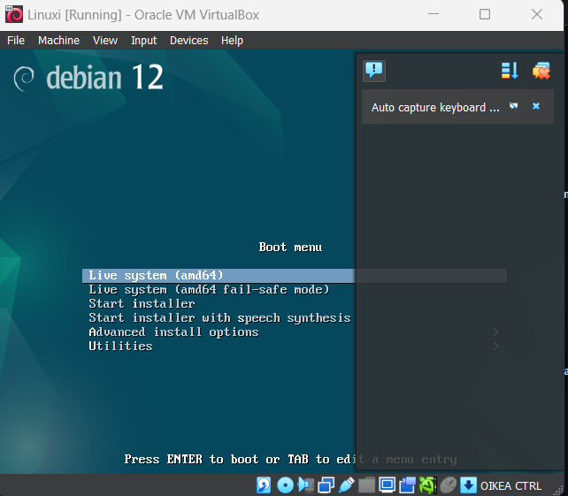
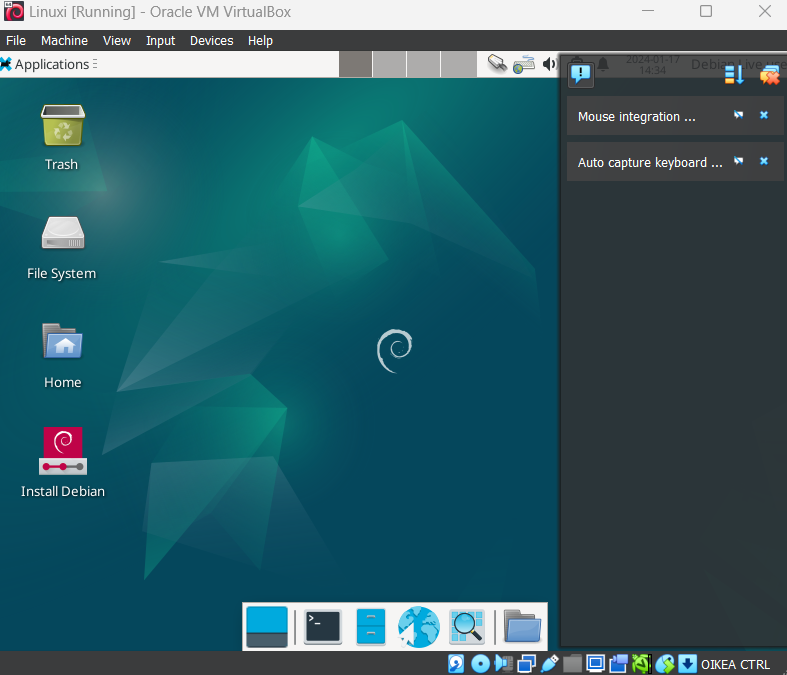
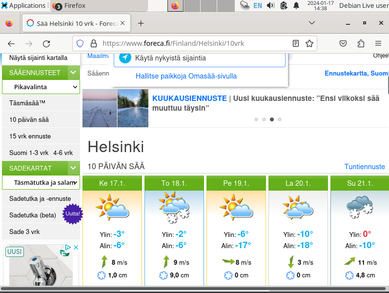
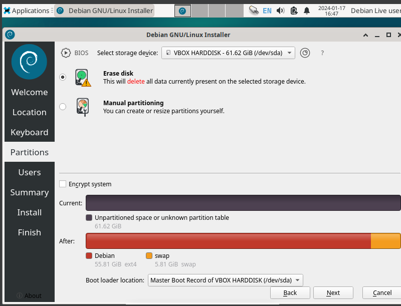

# Linux-palvelimen asennus 17.1.2024.

## 1. Raportin kirjoittaminen klo. 14.36.

### Millainen on hyvä raportti?

Karvinen, Tero 4.6.2006. Raportin kirjoittaminen. (https://terokarvinen.com/2006/raportin-kirjoittaminen-4/) mainitaan seuraavia kohtia:

- Hyvä raportti on toistettava eli kun annat raportin toiselle opiskelijalle pitää tulla samanlainen tulos.
- Täsmällinen. Pitää ilmaista mitä klikkasit, kellonajat, onnistuiko työ sekä mahdolliset epäonnistumiset.
- Helppolukuinen. Raportissa tulee käyttää väliotsikoita, huolellista kieltä sekä kirjoittaa kohtuudella.
- Muista myös viitata lähteisiin. 

## FSF free software definition klo. 14.58.

### Artikkelin tiivistelmä

Free software foundation. 1.1.2024. What is free software? (https://www.gnu.org/philosophy/free-sw.html) kerrotaan mitä on ilmainen tietokoneohjelma.

 Ilmaisen tietokoneohjelman määritys:
 - Vapaus ajaa ohjelmaa milloin haluat ja miten.
 - Vapaus opiskella ohjelman toimintaa ja muokata sitä.
 - Vapaus uudelleen jakaa kopioita ohjelmasta.
 - mVapaus jakaa kopioita muokkaamastasi ohjelmasta muille.

## Linuxin asennus virtuaalikoneeseen. klo. 15.07.

### Ympäristö

Koneenani toimii Lenovon ideapad gaming 3.

## Virtual box ja Debian

### 1. vaihe. Ohjelmien lataaminen. klo. 15.09.

Latasin Oraclen Virtual Boxin sekä Debian Live -levykuvan.
Virtual Boxin latasin netistä virtual boxin nettisivuilta (https://www.virtualbox.org/wiki/Downloads). Valitsin siihen windows hostin.

 

Debianin löysin Tero Karvisen etusivulta mikä näytettiin tunnilla: (https://terokarvinen.com/2021/install-debian-on-virtualbox/) Seurasin sivulla esitettyjä ohjeita. 

## 2. vaihe. Debianin lisääminen virtual boxiin. klo. 15.18.

Aloitin avaamalla Virtual Box managerin. Seuraavaksi valitsin uuden virtuaali koneen. Vaihdoin tilan expert modeen. Sitten nimesin koneen. Laitoin nimeksi Linuxi. Seuraavaksi lisäsin ISO-imageen juuri ladanneeni Debian live tiedoston. Tämän jälkeen vaihdoin tyypin Linuxiin sekä version Debian 64-bittiin. 

 

Seuraavaksi menin kohtaan hardware. Siirsin base memoryn 2800 MB sekä prosessori kohtaan 2 ydintä.

 

Sitten on enää kovalevy, johon varasin tilaa noin 60 GB. Lopuksi painoin "finnish"

 

Seuraavaksi valitsin juuri luomani virtuaalikoneen ja menin asetuksiin. Asetuksissa menin kohtaan "storage" josta valitsin tyhjän levyn ja painoin ok.

## 3. vaihe. Virtuaalikoneen käynnistys. klo 16.23.

Ensimmäisenä avasin virtuaalikoneen tupla klikkaamalla sen kuvaa. Valitsin valikosta Live system (amd64) ja painoin enter.

 

Seuraavaksi kokeilin toimiiko virtuaalikone niin kuin pitääkin. Menin googlessa forecan sivuille katsomaan päivän säätä. Huomasin kuitenkin, että näppäimistön Ä- ja Ö-kirjaimet eivät toimi.

Valitsin työpöydältä "Install Debian". Ensiksi valitsin kielen, johon laitoin American English. Laitoin alueeksi Euroopan ja vyöhykkeeksi helsingin. Vaihdoin näppäimistöksi suomen ja "default" vaihtoehdolla. 

Seuraavaksi pääsin "partions" kohtaan, jossa valitsin kohdan "erase disk", jotta virtuaalisella levyllä ei ole mitääm ylimääräistä. Lopuksi painoin "next".

Seuraavaan kohtaan lisäsin käyttäjätiedot. 

