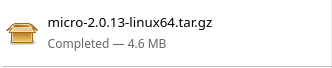
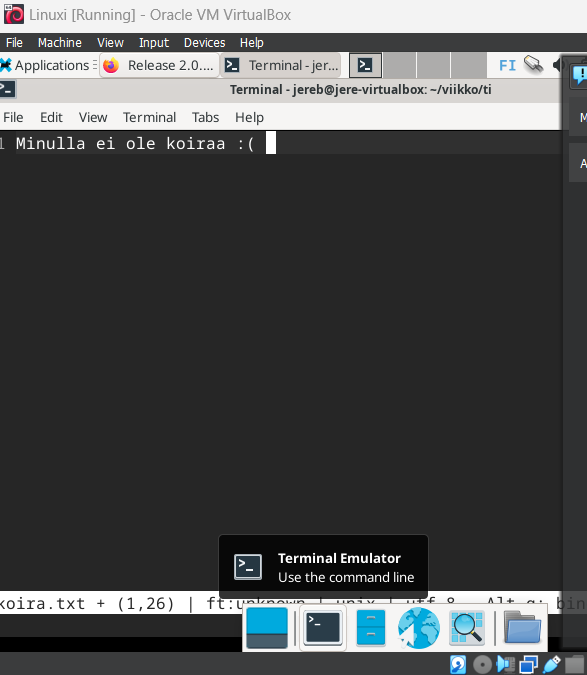
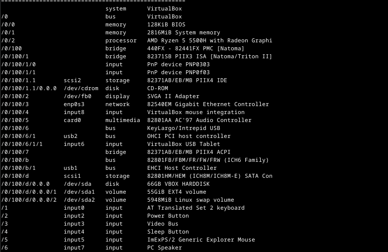

# h2 Komentaja pingviini

## Command line basics [Tero Karvinen](https://terokarvinen.com/2020/command-line-basics-revisited/?fromSearch=command%20line%20basics%20revisited)

- Tärkeät liikkumiseen käytettävät komennot ovat: pwd, ls,cd, cd .. ja less.
- Tiedostojen muokkaamiseen käytettäviä komentoja ovat mm. nano, pico ja micro.
- Kansioiden hallinnassa tärkeitä komentoja ovat mm. mkdir, mv OLDNAME NEWNAME, mv SOMEFILE NEWDIR, rmdir EMPRTYDIR.
- SSH:n avulla voi avata uuden komentotulkin. esim. ssh tero@example, jossa tero on käyttäjätunnus ja serveri on example.com. 
- SSH:sta voi poistua komennolla remotecomputer$ exit
- Manuaali: man ls.

## Asennetaan micro editor klo. 14.01.

Aloitin lataamalla netistä micro editorin linuxille.

Seuraavaksi menin komentotulkkiin ja asensin micron.
Aloitin kirjoittamalla seuraavan komennon:

    sudo apt-get update

Jotain tapahtui ja sitten kokeilin vielä asentaa micron:

    sudo apt-get -y install micro

Kokeilin toimiiko micro

    micro koira.txt

Micro toimi niin kuin pitääkin!

## Koneen rauta klo. 14.34.

Aloitin käyttämällä seuraavaa komentoa:

    sudo lshw -short -sanitize

Komentotulkki sanoi, että "command not found", joten päätin asentaa lshw:n.

    sudo apt-get update

ja 

    sudo apt-get -y install 

Nyt kun lshw on ladattu kokeilin listausta uudelleen.

    sudo lshw -short -sanitize

Komento vihdoin toimi ja sain listauksen tietokoneeni ominaisuuksista. Listassa on mielestäni kaikki oleellinen mitä tietokoneesta tarvitsee tietää.

## Kolme komentoriviohjelmaa klo. 14.59.
