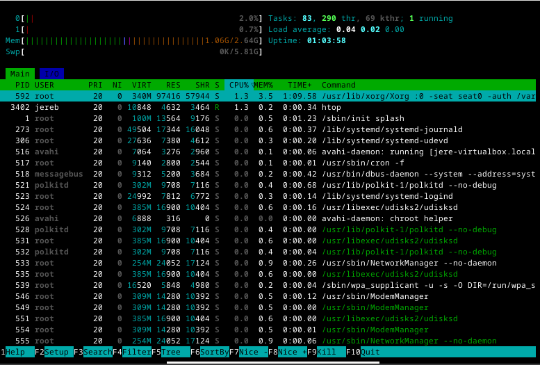
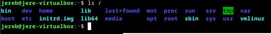
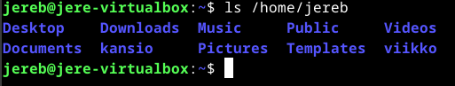
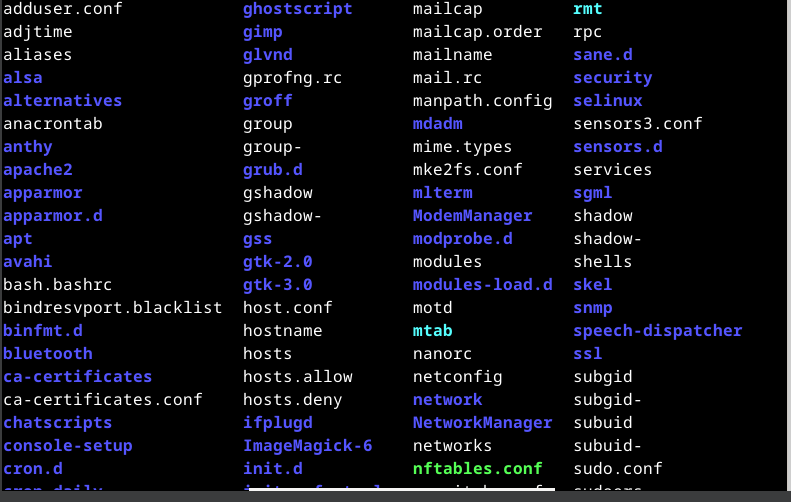
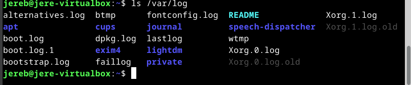
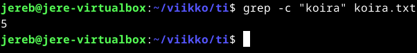
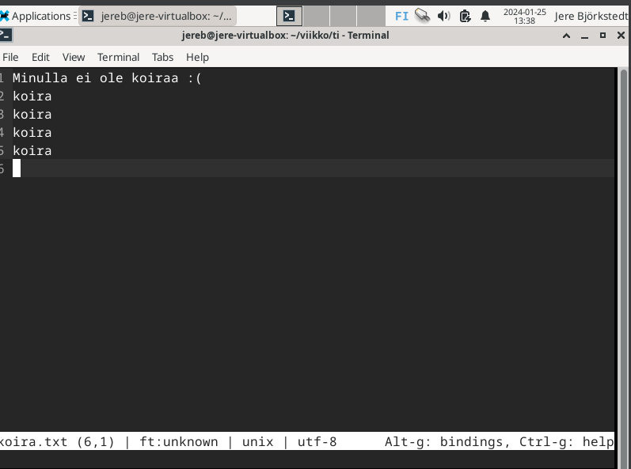
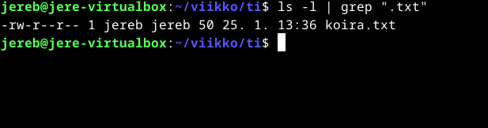

# h2 Komentaja pingviini

## Command line basics [Tero Karvinen](https://terokarvinen.com/2020/command-line-basics-revisited/?fromSearch=command%20line%20basics%20revisited)

- Tärkeät liikkumiseen käytettävät komennot ovat: pwd, ls,cd, cd .. ja less.
- Tiedostojen muokkaamiseen käytettäviä komentoja ovat mm. nano, pico ja micro.
- Kansioiden hallinnassa tärkeitä komentoja ovat mm. mkdir, mv OLDNAME NEWNAME, mv SOMEFILE NEWDIR, rmdir EMPRTYDIR.
- SSH:n avulla voi avata uuden komentotulkin. esim. ssh tero@example, jossa tero on käyttäjätunnus ja serveri on example.com. 
- SSH:sta voi poistua komennolla remotecomputer$ exit
- Manuaali: man ls.

## Asennetaan micro editor klo. 14.01. 24.1.2024.

Aloitin lataamalla netistä micro editorin linuxille.

Seuraavaksi menin komentotulkkiin ja asensin micron.
Aloitin kirjoittamalla seuraavan komennon:

    sudo apt-get update

Jotain tapahtui ja sitten kokeilin vielä asentaa micron:

    sudo apt-get -y install micro

Kokeilin toimiiko micro

    micro koira.txt

Micro toimi niin kuin pitääkin!

## Koneen rauta klo. 14.34.

Aloitin käyttämällä seuraavaa komentoa:

    sudo lshw -short -sanitize

Komentotulkki sanoi, että "command not found", joten päätin asentaa lshw:n.

    sudo apt-get update

ja 

    sudo apt-get -y install 

Nyt kun lshw on ladattu kokeilin listausta uudelleen.

    sudo lshw -short -sanitize

Komento vihdoin toimi ja sain listauksen tietokoneeni ominaisuuksista. Listassa on mielestäni kaikki oleellinen mitä tietokoneesta tarvitsee tietää.

## Kolme komentoriviohjelmaa klo. 14.59.

Päätin asentaa htopin, rsyncin ja grepin [ChatGPT:n](https://chat.openai.com/c/176e58a2-5422-4c43-9604-6485e4525e6c) ehdotuksena. 

    sudo apt-get -y install htop rsync grep

Lataus onnistui. Seuraavaksi kokeilin ohjelmien toimintaa. 

Ensimmäisenä htop joka toimi oikein mallikkaasti. Htop on prosessienvalvonta työkalu linuxille ja se näyttää kaikki käynnissä olevat prosessit ja niiden käyttämät resurssit.

    htop 

Seuraavaksi kokeilin rsynciä, mutta en saanut sitä toimimaan tai en ymmärtänyt mitä sitä kuuluu tehdä. Kokeilin tälläista komentoa:

    rsync -avz/viikko/jereb@virtualbox:/Työpöytä/

Viimeisenä kokeilin greppiä, jonka avulla etsin tietyn teksitiedoston yhden sanan avulla.

    grep -i koira koira.txt
    
 

## FHS klo. 15.40.

Laitoin komentotulkkiin seuraavan komennon:

    ls / 

Komennon jälkeen sain seuraavan listan, jossa on kaikki kansiot. 

 

Seuraavaksi listaus mitä kansiot/tiedostot sisältävät.

    ls /home 
Sisältää Kaikki home-hakemistot.

    ls /home/jereb

Kaikki henkilökohtaiset tiedostot.

    ls /etc

Kaikki järjestelmän asetukset.

    ls /media

Kaikki media, mutta itsellä se oli tyhjänä. 

    ls /var/log

Kaikki järjestelmän lokitiedot klo. 16.38.

## GREP 25.1.2024. klo. 13.27.

### tekstinhaku tiedostosta.

Grepin avulla voi esimerkiksi hakea erilaisia sanoja tiedostoista mm. näin: 

    grep "koira" koira.txt

Grepin avulla voi myös laskea kuinka monta kertaa tietty sana esiintyy tiedostossa. 

    grep -c "koira" koira.txt

Tässä vielä todiste siitä mitä koira.txt sisältää.

## Pipe/putki klo. 13.44.

Putken avulla on mahdollista yhdistää eri komentoja. Seuraavan komennon avulla listaan kaikki "txt"-päätteiset tiedostot hakemistossa. 

    ls -l | grep ".txt"

Seuraavassa kuvassa näkyy, että minulla on vain yksi "txt" päätteinen tiedosto.

## Tukki klo. 13.58.

## Lähteet

ChatGPT open AI. 2024. https://chat.openai.com/c/ec7f1b40-10c6-4b83-8532-280d0310dc23 

