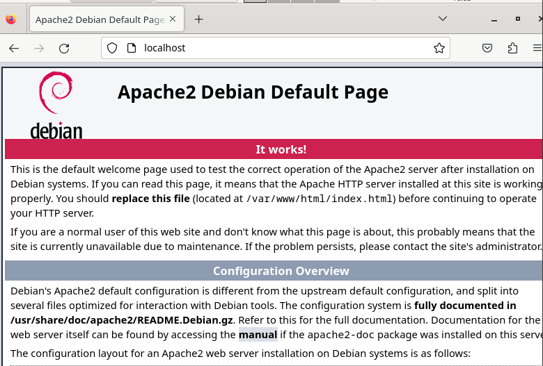
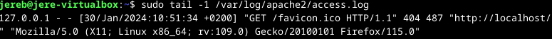

#h3 Hello Web Server

## Artikkelit 31.1.2024. klo. 14.25.

### [The Apache Sowftware Foundation.](https://httpd.apache.org/docs/2.4/vhosts/name-based.html) 

- IP-pohjaiset virtuaali hostit käyttävät yhteyden IP-osoitetta oikean hostin määrittämiseen. Siksi jokaiselle hostille tarvitaan oma IP-osoite.
- Nimipohjaisessa virtuaali hostauksessa palvelin luottaa siihen, että asiakas ilmoittaa host-nimen osana HTTP-otsikoita. Tekniikan avulla moni hosti voi jakaa saman IP-osoitteen.
- Nimipohjainen virtuuali hostaus on yleensä helpompaa, sillä tarvitsee vain määrittää DNS-palvelin yhdistämään jokainen hosti oikeaan IP-osoitteeseen ja sen jälkeen määrittää apache HTTP-palvelin tunnistamaan eri host-nimet. 

### [Name Based Virtual Hosts on Apache](https://terokarvinen.com/2018/04/10/name-based-virtual-hosts-on-apache-multiple-websites-to-single-ip-address/) 

- Apachen avulla voi olla monia verkkotunnuksia, joilla on sama IP-osoite.
- Asenna ja määritä verkkopalvelin, korvaa oletussivusto seuraavilla komennoilla:

      sudo apt-get -y install apache2
  
      echo "Default" | sudo tee /var/www/html/index.html

- Lisää uusi nimipohjainen virtuaalipalvelin:

      sudoedit /etc/apache2/sites-available/pyora.example.com.conf 
      cat /etc/apache2/sites-available/pyora.example.com.conf
      <VirtualHost *:80>
      ServerName pyora.example.com
      ServerAlias www.pyora.example.com
      DocumentRoot /home/xubuntu/publicsites/pyora.example.com
      <Directory /home/xubuntu/publicsites/pyora.example.com>
       Require all granted
      < /Directory>
      </VirtualHost>
      $ sudo a2ensite pyora.example.com
      $ sudo systemctl restart apache2

- Luo verkkosivu tavallisena käyttäjänä:

      mkdir -p /home/xubuntu/publicsites/pyora.example.com/
      echo pyora > /home/xubuntu/publicsites/pyora.example.com/index.html

  - Testaus:

        curl -H 'Host: pyora.example.com' localhost
        curl localhost

## Weppipalvelimen vastaustesti klo. 15.35.

Aloitin lataamalla apache-weppipalvelimen seuraavalla komennolla:

    sudo apt-get -y install apache2

Seuraavaksi testasin vastaako palvelin localhost osoitteesta. Huomasin kuitenkin, että minulla oli jäänyt aiemmin tehty testisivu päällä, joten laitoin sen pois päältä: 

     sudo dissite jereb.conf

     systemctl reload apache2

Tämän jälkeen sain default sivun näkymiin ja samalla testaus myös onnistui!

 

## Lokin rivit klo. 16.09.

Aloitin syöttämällä seuraavan komennon: 

    sudo tail -1 /var/log/apache2/acces.log

 

### Lokien analysointi:
- Lokeista selvisi, että Localhost IP-osoite on 127.0.0.1.
- Lokit käyttävät reaaliaikaista päivämäärää ja aikaa.

    
