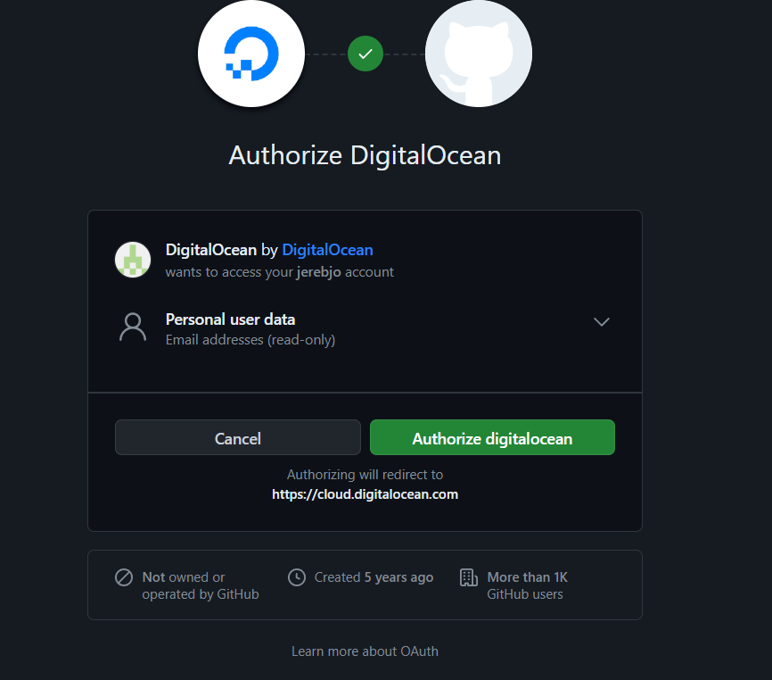
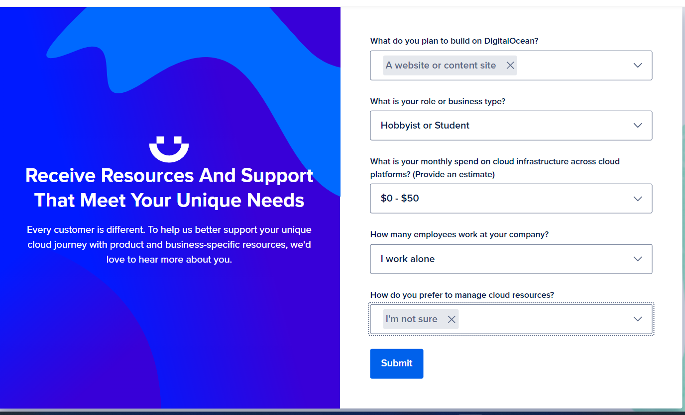
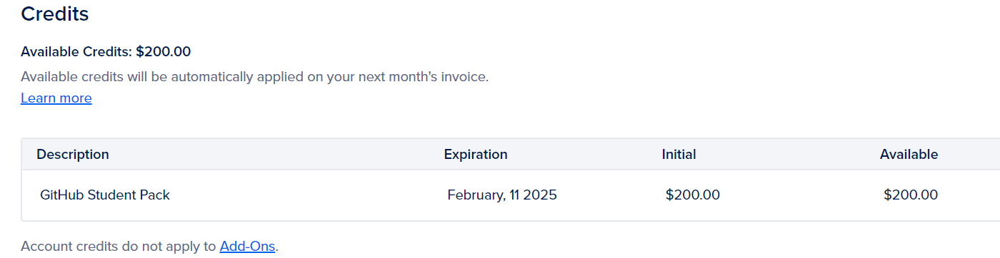
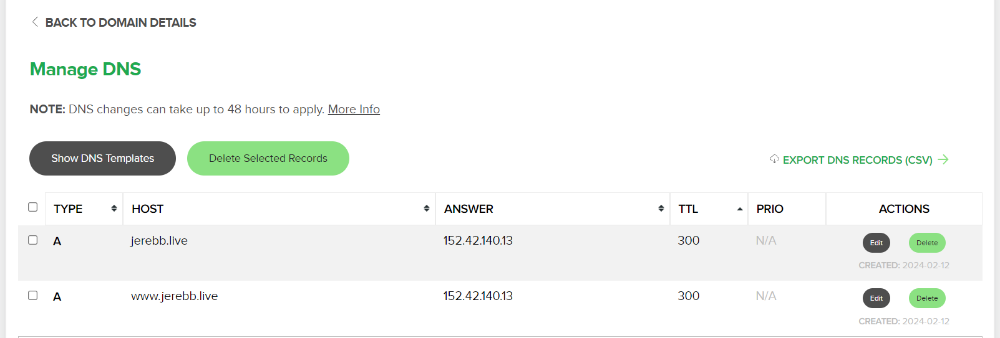
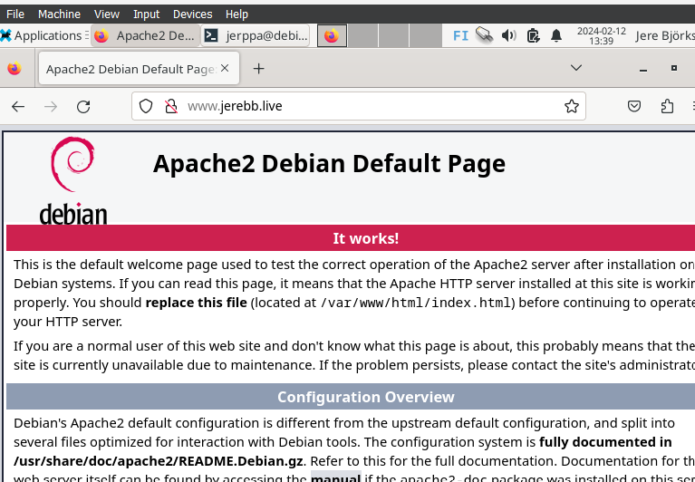
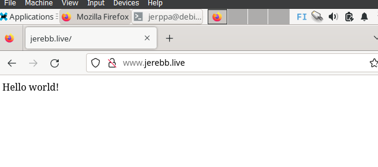
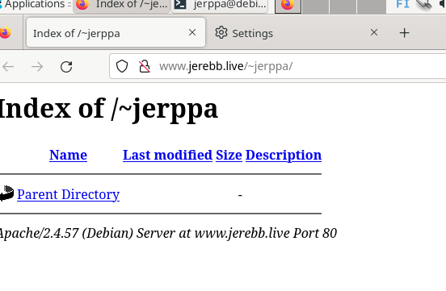
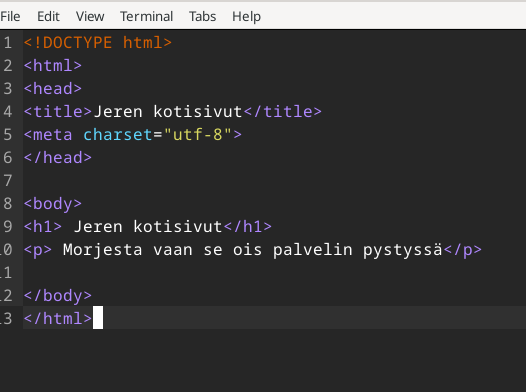
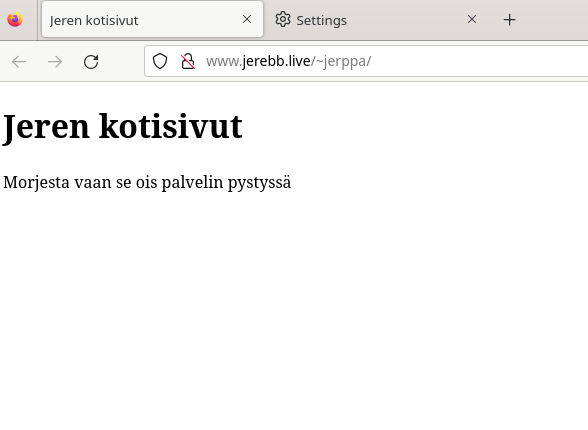

# H4 Maailma kuulee

## Käyttöympäristö

Prosessori: AMD Ryzen 5 5500H

RAM: 8 GB DDR4

Näytönohjain: NVIVIA GeForce RTX 2050

Käyttöjörjestelmä: Windows 10

## Artikkelit klo. 11.38.

### [Teoriasta käytäntöön pilvipalveluiden avulla](https://susannalehto.fi/2022/teoriasta-kaytantoon-pilvipalvelimen-avulla-h4/)

- Vuokrattavia pilvipalveluita voi kokeilla ilmaiseksi esim. Github -educationin sekä pilvioperaattorien tutustumistarjouksien avulla.

- Palomuurin avulla suojataan oma palvelin. Ssh:n avulla tehdään reikä palomuuriin.

- Oma kotisivu tehdään esim. Apachen webbipalvelimen avulla. Korvaa default-sivu ja laita tilalle oma sivu.

- Palvelimelle tulee päivittää kaikki oleelliset ohjelmat.

### [First steps on a new virtual private server](https://terokarvinen.com/2017/first-steps-on-a-new-virtual-private-server-an-example-on-digitalocean/)

- On tärkeää käyttää hyvää salasanaa välttääkseen tietoturva haitat.

- Ensimmäisen kerran kirjautuessa pitää käyttää ``ssh root@` + serverin ip-osoite.

- Reikä SSH:lle ennen kuin laitat palomuurin päälle  `sudo ufw allow 22/tcp` ja palomuuri päälle: `sudo ufw enable`

- Sudo käyttäjällä pitää kirjautua sisään ennen rootin sulkemista.

- Lukitaan root tili `sudo usermod --lock root`

- Vanhat paketit tulee päivittää tietoturvallisuuden vuoksi `sudo apt-get update` ja `sudo apt-get upgrade`

## Oman virtuaalipalvelimen vuokraus klo.11.57.

Käytin tehtävässä apuna Susanna Lehdon [raporttia](https://susannalehto.fi/2022/teoriasta-kaytantoon-pilvipalvelimen-avulla-h4/) sekä [Jenna Hakala](https://github.com/haksutin) apua discordin välityksellä. Alotin työskentelyn menemällä digital oceanin sivuille, missä aijon luoda uuden käyttäjän jolle vuokraan pilveä. Käyttäjän luominen alkoi hyvin sillä pystyin kirjautumaan github-käyttäjän avulla.

Seuraavana aloitin täyttämään tietoja. 

Sitten piti tehdä varmistus jossa päädyin käyttämään visaa. Vastaan tuli kuitenkin ongelma, sillä en ollut vielä hnakkinut github -educationia, joten jouduin odottamaan vahvistusviestiä muutaman päivän.

githubin vahvitusviesti saapui. 12.2.2024 klo 11.20.

 

Seuraavaksi aloitin vuokraamisen. Aloitin luomalla oman dropletin johon valitsin alueeksi `Amsterdam`. Seuraavaksi valitsin `debian`, Droplet typeksi valitsin `Basic`, CPU optioniksi valitsin `regular` ja otin halvimman mahdollisen vaihtoehdon. Varmistus tavaksi valitsin salasanan, johon loin vahvan salasanan. Hostnameksi laitoin `debian`. 

## Alkutoimet klo. 11.40.

Päädyin tekemään työn linuxin terminaalissa.

Alotin kopioimalla palvelimen ip-osoitteen ja syötin sen terminaaliin `ssh root@` + ip-osoite. Laitoin myös luomani salasanan. 

Sitten tein palomuuriin reijän. Huomasin, että en ole asentanut ufw:tä. Asensin sen komennolla: `sudo apt-get -y install ufw`.

Nyt kun palomuuri on asennettu tein siihen reijän komennolla: `sudo ufw allow 22/tcp` ja `sudo ufw enable`.

Seuraavaksi tein käyttäjän josta tein pääkäyttäjän. Uuden käyttäjän lisäys: `sudo adduser jerppa`. Käyttäjästä pääkäyttäjä: `sudo adduser jerppa sudo`

Testasin että käyttäjä toimii windowsin powershellissä:`ssh jerppa@` + ip-osoite. Homma toimi niin kuin pitääkin.

Sitten lukitsin juuren käyttäjän komennolla: `ssh root@` + ip-osoite. Kokeilin vielä onnistuiko lukitus, kokeilemalla kirjautua sisään, mutta se ei onnistunut. 

Sitten päivitin virtuaalipalvelimen ohjelmat tietoturvaa parantaakseni: `sudo apt-get update` ja `sudo apt-get upgrade`.

Seuraavana tein palomuuriin reijän julkista palvelinta varten: `sudo ufw allow 80/tcp`. 

Viimeiseen kohtaan minun piti hankkia oma ilmainen webbisivu [name.com](https://www.name.com/) avulla. 

 

## Testailua klo. 15.30.

Kokeilin toimiiko sivu apachen testisivun avulla. Latasin ensin apachen komennolla `sudo apt-get isnstall apache2`. Testisivu näytti toimivan niin kuin pitää. 

 

Seuraavana kokeilin tehdä oman testisivun ja tarkistaa toiminnan: `echo Hello World! | sudo tee /var/www/html/index.html`.

 

Seuraavaksi otin terminaalissa userdir-moduulin käyttöön ja käynnistin palvelimen uudelleen komennolla: `sudo a2enmod userdir` ja `sudo service apache2 restart
`. 

Loin käyttäjälleni kotihakemistoon uuden public_html kansion: `sudo mkdir public_html`. Sivu kuitenkin väitti, ettei ole lupaa sinne, joten syötin `sudo chmod +x /home/jerppa`. Tämän jälkeen hakemisto tuli näkyviin nettisivulle.

 

Seuraavaksi tein tekstitiedoston julkiseen hakemistoon. Avasin SSH-yhteyden ja latasin micron: `sudo systemctl start ssh` ja `sudo apt-get install micro` 

Menin public_html hakemistoon ja tein index.html tiedoston microlla: `cd public_html` ja `micro index.html` 

Seurvaanan avasin micron: `micro inde.html` johon tein hyvin vaatimattoman html sivun.

 

Sivu näytti toimivan myös selaimessa. 

 

## Lähteet 

Karvinen, T. 6.2.2024. Luento.

Karvinen, T. Tehtävänanto. https://terokarvinen.com/2024/linux-palvelimet-2024-alkukevat/#h4-maailma-kuulee

Karvinen, T. 2012. First Steps on a New Virtual Private Server – an Example on DigitalOcean and Ubuntu 16.04 LTS. https://terokarvinen.com/2017/first-steps-on-a-new-virtual-private-server-an-example-on-digitalocean/ 

OpenAI. ChatGPT. 12.2.2024. https://chat.openai.com/

Digital Ocean. Luettavissa: https://www.digitalocean.com/ 

Github education. https://education.github.com/pack 

Name. Luettavissa: https://www.name.com/ 

Lehto, S. 14.2.2022. Teoriasta käytäntöön pilvipalvelimen avulla (h4) https://susannalehto.fi/2022/teoriasta-kaytantoon-pilvipalvelimen-avulla-h4/ 

Hakala, J. 12.2.2024. https://github.com/haksutin 

