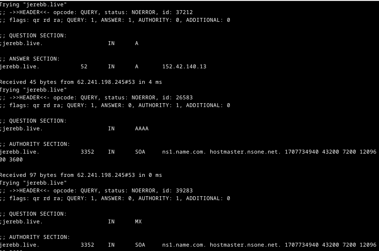

# Koko homma h5

## Käyttöympäristö

Prosessori: AMD Ryzen 5 5500H

RAM: 8 GB DDR4

Näytönohjain: NVIVIA GeForce RTX 2050

Käyttöjörjestelmä: Windows 10

## Virtuaali koneen asennus klo. 11.07.

Virtuaalikoneen asennuksen yhteydessä tulee olla ladattuna "Oraclen Virtual Box" sekä "debian-live-12.4.0.amd64".

Aloitetaan asennus avaamalla virtual box ja lisätään uusi virtuaalikone. Tämän jälkeen valitaan "Name and operating system" kohtaan haluamasi nimi, Iso imageen juuri ladattu debian-live, Tyypiksi `Linux` ja versioksi `64-bit`. Klikataan myös "skip unattended installation".

 

Seuraavaksi siirrytään kohtaan "hardware". Syötetään `base memory` riittäväksi. Päädyin laittamaan 2500 MB. Processors kohtaan laitoin "2". 

 

Siirrytään kohtaan "Hard Disk". Tässä kohtaan lisäsin ainoastaan "hard disk" -kokoa. Sen laitoin noin `50 GB`.

 

Lopuksi klikataan "Finish". Tämän jälkeen voidaan käynnistää juuri luotu virtuaalikone. Koneen avattua tulee valikko, jossa valitaan "Live system (amd64)" ja painetaan `enter`. 

 

Tämän jälkeen täytyy testata että netti toimii normaalisti. Joku simppeli google haku toimii. 

Seuraavana täytyy ladat debian virtuaalikoneen sisällä, joten klikataan "install debian" ja valitaan "launch anyway".

 

Debiaan laitetaan seuraavat tiedot:

- Käyttöjärjestelmä: American english
- Alue: Europe ja Vyöhyke: Helsinki
- Näppäimistöksi: Finnish ja näppäimistön tyyppi: Default
- Valitaan "erase disk" ja painetaan alhaalta "next"
- Lopuksi täytetään käyttäjä tiedot. Tärkeää vahva salasana.

Seuraavaksi painetaan "Install" (huom. ikkunan tulee olla kokoruutu tilassa, sillä muuten "Install" painike ei näy).

 

Lataamisessa voi kestää hetki. Lataamisen jälkeen painetaan "done" ja "restart now"

Seuraavana kirjaudutaan sisään luodulle käyttäjälle. Kuvassa näkyy onnistunut kirjautminen.

 

Testataan vielä lopuksi toimiiko internetti. Kokeilin testinä katsoa säätä [forecan sivuilta](https://www.foreca.fi/Finland/) 

 

## Apachen ja SSH asennus klo. 12.08.

Seuraavaksi siirrytään apache2 asennukseen. Mennään linuxin terminaaliin ja katsotaan ensin ollaanko oikeassa hakemistossa komennolla `pwd`. jos komentotulkki tulostaa `home/käyttäjätunnus` ollaan oikeassa hakemistossa. Seuraavaksi asennetaan apache2 syöttämällä komenti: `sudo apt-get install apache2` syötetään käyttäjän salasana ja painetaan `Y`.

 

Seuraavan kokeillaan onnistuiko asennus testaamalla googlessa toimiiko "default-sivu". Kirjoitetaan googleen "localhost". Sivu näytti toimivan niin kuin pitääkin.

 

Seuraavana asennetaan myös SSH. SSH:n asennus tapahtuu komentotulkissa komennolla: `sudo apt-get install ssh` ja `Y`. 

Sitten lisätään uusi "name-based virtual host". Tätä kohtaa varten asensin micro-tekstieditorin komennolla: `sudo apt-get -y install micro` nyt kun micro on ladattu voidaan luoda uusi virtual host tekstitiedostoon. Avataan micro komennolla: `EDITOR=micro sudoedit /etc/apache2/sites-available/sivu.com.conf` Kuvassa näkyy kuinka Virtual Host luodaan. 

 

Seuraavana laitetaan sivu päälle, sillä tällä hetkellä siellä on vielä testisivu päällä. Mutta ensin otetaan default-sivu pois päältä. Siirrytään hakemistoon `etc/apache2/sites-available`. Tämän jälkeen syötetään komento: `sudo a2dissite 000-default.conf` ja `sudo systemctl restart apache2`.

Tämän jälkeen voidaan laittaa juuri luotu sivu päälle komennolla: `sudo a2ensite sivu.com.conf` ja `sudo systemctl restart apache2`. 

Sivulla ei ole tällä hetkellä vielä mitään, joten luodaan webbisivu normaalina käyttäjänä: `mkdir -p /home/jereb/publicsites/sivu.com/`. Seuraavaksi testaan vastaako sivu komennolla: `echo moro > /home/jereb/publicsites/sivu.com/index.html`. Niin kuin kuvasta näkyy sivu vastasi onnistuneesti.

 

Seuraavaksi vielä muokkasin hiukan sivuani menemällä publicsites kansiossa luomaani index.html tiedostoon: `micro index.html`. 

 

## Julkinen SSH-avain klo. 13.21.

Seuraavaksi automatisoidaan kirjatuminen julkisen SSH-avaimen avulla. Aloitetaan syöttämällä komento `ssh jereb@localhost` ja kirjoitetaan `yes`.

Seuraavaksi syötetään komento: `ssh-keygen` ja painetaan enteriä kolme kertaa. 

 

Seuraavana komento: `ssh-copy-id jereb@localhost` jolla lisätään ssh-avain. 

 

Lopulta vielä testataan toimiiko kirjautuminen ssh-avaimella komennolla: `ssh jereb@localhost` Kuvasta näkyy kun kirjautuminen on onnistunut.

 

## Digging Host klo. 13.45.

Tarkoituksena on tutkia domain-nimeni tietoja `host` ja `dig` komentojen avulla. Ladataan ensin `dnsutils`, jotta voidaan käyttää komentoja: `sudo apt-get -y install dnsutils`. Käytin tulkintojen tukena [ChatGPT:tä](https://chat.openai.com/)

Tutkitaan ensin vuokraamani webbisivun `host` tietoja: `host jerebb.live`. Komentotulkki tulosti domainin ip-osoitteen. Host-komentoja on erilaisia toinen esimerkki voisi olla esimerkiksi `host -v`. Tämä antaa yksityiskohtaisempia tietoja kyselyn suorittamisesta. Suoritin komennon: 

    host -v jerebb.live

 

Tuloksesta selviää esim.

- Trying jerebb.live: Näyttää että host-ohjelma yrittää selvittää tietoja osoitteesta "jerebb.live"
- Header: Näyttää dns-paketin header tiedot.
- Question section: näyttää mitä kyselyä tehtiin ja millä tyypillä.
- Answer section: näkyy vastaus kenttä kuten ip-osoite tai toimintatiedot

Seuraavaksi tutkitaan `dig`-komentoja. Aloitin kirjoittamalla komennon: 

    dig jerebb.live

 
