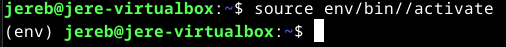
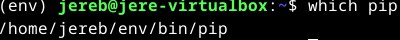
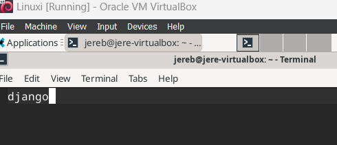
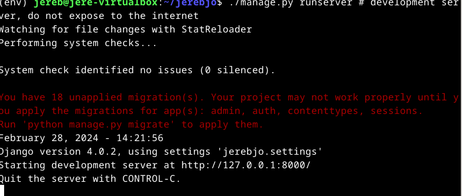
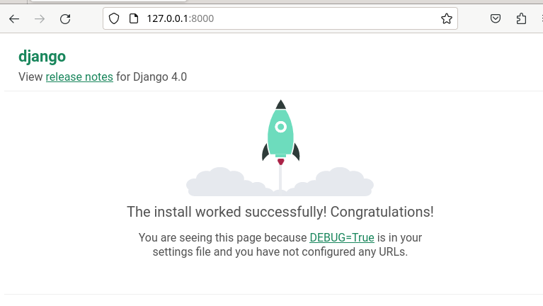
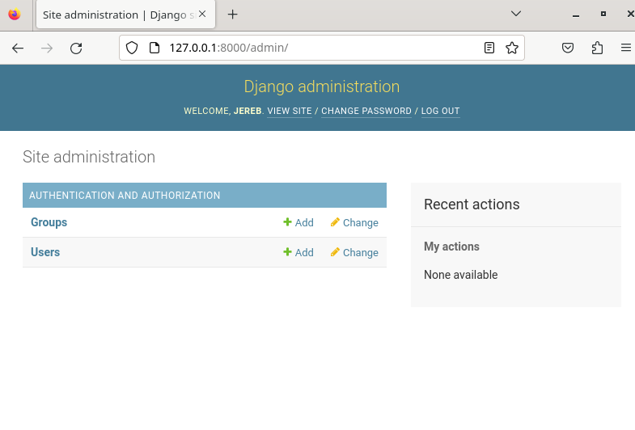
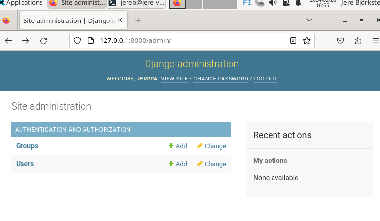
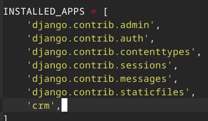
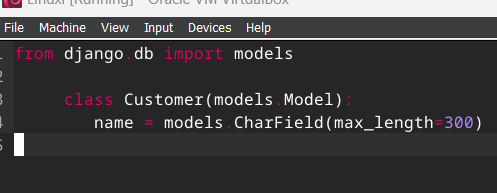

# H6 Django

## Käyttöympäristö

Prosessori: AMD Ryzen 5 5500H

RAM: 8 GB DDR4

Näytönohjain: NVIVIA GeForce RTX 2050

Käyttöjörjestelmä: Windows 10

## Lue ja tiivistä klo. 15.04.

### [Django 4 Instant Customer Database Tutorial](https://terokarvinen.com/2022/django-instant-crm-tutorial/) (Karvinen, T).

- Artikkelin avulla voi opetella `Django 4` perusteet eli kuinka se ladataan ja mitä sillä oikeastaan tehdään.
- Djangon avulla voi esimerkiksi luoda tietokannan asiakkaille, jota usea käyttäjä voi käyttää.
- Tietokanna admineille tulee tehdä jokaiselle oma henkilökohtainen salasana.

### [Deploy Django 4 - Production Install](https://terokarvinen.com/2022/deploy-django/) (Karvinen, T).

- Django Pythonin avulla on helppo luoda webbipalveluita.
- Artikkelia seuraamalla opitaan lataamaan `Python Django 4`, käyttäen `apache 2.4` ja `mod_wsgi`.

## Yksinkertainen esimerkki ohjelma Djangolla. klo. 15.24. 

Tehtävässä on käytetty apuna Tero Karvisen artikkelia [Django 4 Instant Customer Database Tutorial](https://terokarvinen.com/2022/django-instant-crm-tutorial/).

Tehtävä toteutetaan virtuaalikoneessa jossa käyttöjärjestelmänä linux. 

Aloitetaan asentamalla `virtualenv` komennolla:

    $ sudo apt-get -y install virtualenv

Luodaan uusi kansio `env/`:

    $ virtualenv --system-site-packages -p python3 env/

Seuraavaksi aktivoidaan virtuaaliympäristö:

    $ source env/bin/activate

Komento on onnistunut kun komentotulkissa näkyy polun edessä `(env)`: 

Varmistetaan vielä, että asennus tulee virtuaaliympäristöön: 

    $ which pip

Niin kuin kuvasta näkyy niin oikeilla jäljillä ollaan:

 

Seuraavaksi laitetaan Python paketti tekstitiedostoon, mutta sitä varten tarvitaan jokin tekstieditori, joten valitsin micron. Asennetaan se komennolla:

    $ sudo apt-get install micro

Tehdään djagolle tiedosto komennolla: 

    $ micro requirements.txt

Tiedostoon kirjoitetaan "django" tämä on tärkeä vaihe, sillä se täytyy kirjoittaa oikein! 

Seuraavaksi tallensin ja suljin tiedoston. 

Ladataan django python komennolla: 

    $ pip install -r requirements.txt

Huomasin, se latasi `django-5.0.2` ja artikkeli on tehty `django 4.0.2`, joten päätin vaihtaa sen version neloseen. Version vaihtaminen toimi yksinkertaisesti niin, että muokkasin `requirements.txt`-tiedostoa, laittamalla sinne `django==4.0.2`. Tämän jälkeen suoritin `pip install -r requirements.txt` uudelleen ja version muuttaminen onnistui. 

### Django projekti klo. 15.58.  

Aloitetaan projekti komennolla: 

    
     $ django-admin startproject jerebjo

Kokeillaan toimiiko.

    $ cd jerebjo

    $ ./manage.py runserver   # development server, do not expose to the internet

 

Avataan vielä selain ja katsotaan toimiiko linkki:

 

Päivitetään tietokanta, jotta päästään `/admin` sivulle. Suljetaan ensin ohjelma `CTRL + C`

    $ ./manage.py makemigrations

    $ ./manage.py migrate 

Lisätään käyttäjä: 

    $ sudo apt-get install pwgen

    $ pwgen -s 20 1 # randomize a password

Tässä kohtaan kopioit satunnaisesti luodun salasanan.

    $ ./manage.py createsuperuser

Käyttäjäksi laitoin ehdotetun `jereb` ja salasanaksi juuri luodun. 

Kokeillaan toimiiko käyttäjä käynnistämällä serveri uudelleen. 

    $ ./manage.py runserver   # development server, do not expose to the internet

Syötetään selaimeen osoite `http://127.0.0.1:8000/admin/`

Seuraavaksi syötetään käyttäjänimi ja salasana.

 

Kuvasta näkyy onnistunut kirjautuminen. 

### Kokeillaan lisätä lisää käyttäjiä serverille. Klo 16.44.

Kirjaudutaan ensin ulos admin käyttäjältä. 

Sitten luodaan uusi käyttäjä komennolla: 

    $ ./manage.py createsuperuser

Loin käyttäjän `jerppa` ja loin sille vahvan salasanan. Lopuksi kokeilin kirjautua sisään. 

 

Kirjautuminen onnistui ongelmitta. Myös tietokannan muokkaaminen onnistuu käyttäjällä. 

### Asiakas tietokannan luonti klo. 16.57.

Aloitetaan luomalla uusi kansio `crm` Asiakassuhteiden hallinta sovellukselle. 

    $ ./manage.py startapp crm

Lisätään sovellus ladattuihin sovelluksiin `settings.py`:ssä.

    $ micro jerebjo/settings.py

Etsitään oikea kohta ja lisätään sinne `crm` näyttää tältä:

 

Lisätään seuraavaksi malleja. 

    $ micro crm/models.py 

Lisätään seuraava koodin pätkä micro-tiedostoon: 

 

`Customer` luokka luo uuden `Customer` taulun tietokantaan. Päivitetään tiedot:

    $ ./manage.py makemigrations

    $ ./manage.py migrate

