# H6 Django

## Käyttöympäristö

Prosessori: AMD Ryzen 5 5500H

RAM: 8 GB DDR4

Näytönohjain: NVIVIA GeForce RTX 2050

Käyttöjörjestelmä: Windows 10

## Lue ja tiivistä 28.2.2024. klo. 15.04.

### [Django 4 Instant Customer Database Tutorial](https://terokarvinen.com/2022/django-instant-crm-tutorial/) (Karvinen, T).

- Artikkelin avulla voi opetella `Django 4` perusteet eli kuinka se ladataan ja mitä sillä oikeastaan tehdään.
- Djangon avulla voi esimerkiksi luoda tietokannan asiakkaille, jota usea käyttäjä voi käyttää.
- Tietokanna admineille tulee tehdä jokaiselle oma henkilökohtainen salasana.

### [Deploy Django 4 - Production Install](https://terokarvinen.com/2022/deploy-django/) (Karvinen, T).

- Django Pythonin avulla on helppo luoda webbipalveluita.
- Artikkelia seuraamalla opitaan lataamaan `Python Django 4`, käyttäen `apache 2.4` ja `mod_wsgi`.

## Yksinkertainen esimerkki ohjelma Djangolla. klo. 15.24. 

Tehtävässä on käytetty apuna Tero Karvisen artikkelia [Django 4 Instant Customer Database Tutorial](https://terokarvinen.com/2022/django-instant-crm-tutorial/).

Tehtävä toteutetaan virtuaalikoneessa jossa käyttöjärjestelmänä linux. 

Aloitetaan asentamalla `virtualenv` komennolla:

    $ sudo apt-get -y install virtualenv

Luodaan uusi kansio `env/`:

    $ virtualenv --system-site-packages -p python3 env/

Seuraavaksi aktivoidaan virtuaaliympäristö:

    $ source env/bin/activate

Komento on onnistunut kun komentotulkissa näkyy polun edessä `(env)`: 

Varmistetaan vielä, että asennus tulee virtuaaliympäristöön: 

    $ which pip

Niin kuin kuvasta näkyy niin oikeilla jäljillä ollaan:

 

Seuraavaksi laitetaan Python paketti tekstitiedostoon, mutta sitä varten tarvitaan jokin tekstieditori, joten valitsin micron. Asennetaan se komennolla:

    $ sudo apt-get install micro

Tehdään djagolle tiedosto komennolla: 

    $ micro requirements.txt

Tiedostoon kirjoitetaan "django" tämä on tärkeä vaihe, sillä se täytyy kirjoittaa oikein! 

Seuraavaksi tallensin ja suljin tiedoston. 

Ladataan django python komennolla: 

    $ pip install -r requirements.txt

Huomasin, se latasi `django-5.0.2` ja artikkeli on tehty `django 4.0.2`, joten päätin vaihtaa sen version neloseen. Version vaihtaminen toimi yksinkertaisesti niin, että muokkasin `requirements.txt`-tiedostoa, laittamalla sinne `django==4.0.2`. Tämän jälkeen suoritin `pip install -r requirements.txt` uudelleen ja version muuttaminen onnistui. 

### Django projekti klo. 15.58.  

Aloitetaan projekti komennolla: 

    
     $ django-admin startproject jerebjo

Kokeillaan toimiiko.

    $ cd jerebjo

    $ ./manage.py runserver   # development server, do not expose to the internet

 

Avataan vielä selain ja katsotaan toimiiko linkki:

 

Päivitetään tietokanta, jotta päästään `/admin` sivulle. Suljetaan ensin ohjelma `CTRL + C`

    $ ./manage.py makemigrations

    $ ./manage.py migrate 

Lisätään käyttäjä: 

    $ sudo apt-get install pwgen

    $ pwgen -s 20 1 # randomize a password

Tässä kohtaan kopioit satunnaisesti luodun salasanan.

    $ ./manage.py createsuperuser

Käyttäjäksi laitoin ehdotetun `jereb` ja salasanaksi juuri luodun. 

Kokeillaan toimiiko käyttäjä käynnistämällä serveri uudelleen. 

    $ ./manage.py runserver   # development server, do not expose to the internet

Syötetään selaimeen osoite `http://127.0.0.1:8000/admin/`

Seuraavaksi syötetään käyttäjänimi ja salasana.

 

Kuvasta näkyy onnistunut kirjautuminen. 

### Kokeillaan lisätä lisää käyttäjiä serverille. Klo 16.44.

Kirjaudutaan ensin ulos admin käyttäjältä. 

Sitten luodaan uusi käyttäjä komennolla: 

    $ ./manage.py createsuperuser

Loin käyttäjän `jerppa` ja loin sille vahvan salasanan. Lopuksi kokeilin kirjautua sisään. 

 

Kirjautuminen onnistui ongelmitta. Myös tietokannan muokkaaminen onnistuu käyttäjällä. 

### Asiakas tietokannan luonti klo. 16.57.

Aloitetaan luomalla uusi kansio `crm` Asiakassuhteiden hallinta sovellukselle. 

    $ ./manage.py startapp crm

Lisätään sovellus ladattuihin sovelluksiin `settings.py`:ssä.

    $ micro jerebjo/settings.py

Etsitään oikea kohta ja lisätään sinne `crm` näyttää tältä:

 

Lisätään seuraavaksi malleja. 

    $ micro crm/models.py 

Lisätään seuraava koodin pätkä micro-tiedostoon: 

 

`Customer` luokka luo uuden `Customer` taulun tietokantaan. Päivitetään tiedot:

    $ ./manage.py makemigrations

    $ ./manage.py migrate

Nähdäkseen tietokanta pitää kirjautua sisään admin-käyttäjällä.

Muokataan `admin.py` -tiedostoa. 

    $ micro crm/admin.py

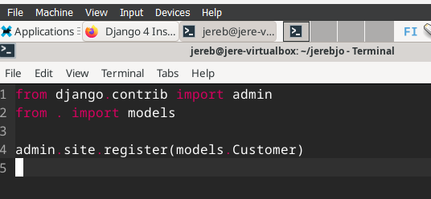 

Katsotaan uutta `Customer` -mallia adminilla.

    $ ./manage.py runserver

Kuvassa näklyy kuinka serverille on ilmestynyt uusi kohta johon voi lisätä uusia asiakkaita. 

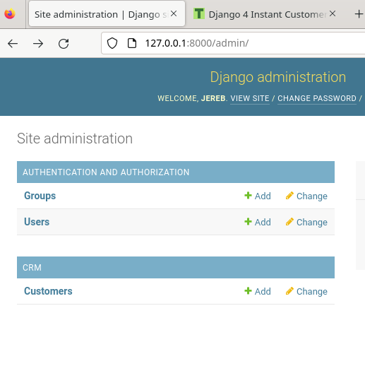 

### Asiakkaiden nimen listaus klo. 17.24.

Sivulle lisätessä uusi asiakas, niiden nimeksi tulee "customer 1", "customer 2"... joten muokataan ohjelmaa siten, että se näyttää asiakkaiden nimet. 

Avataan micro:

    $ micro crm/models.py

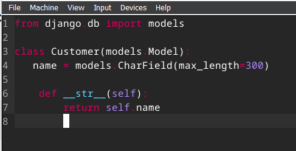 

Kokeillaan vielä lisätä muutama uusi asiakas. 

Muistetaan vielä päivittää muutokset: 

     $ ./manage.py makemigrations

     $ ./manage.py migrate

Avataan serveri: 

    $ ./manage.py runserver

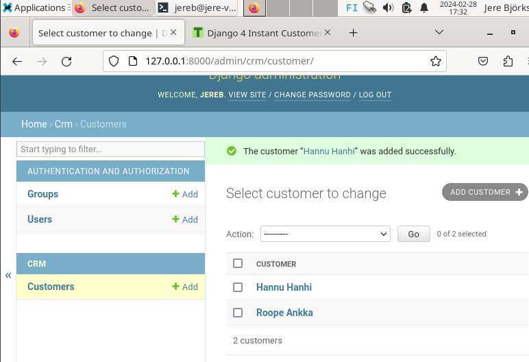 

Kuvasta näkyy kuinka sivuston tyyli on muuttunut erilaiseksi, joten muutos onnistui. 

Nyt asiakkaiden lisäys onnistuu niiden omilla tunnistettavalla tavalla! 28.2.2024. klo. 17.35.

## Djangon tuotantotyyppinen asennus 29.2.2024 klo. 14.05.

Tässä tehtävässä on käytetty apuna Tero Karvisen artikkelia [Deploy Django 4 - Production Install](https://terokarvinen.com/2022/deploy-django/)

Aloitetaan päivittämällä paketti

    $ sudo apt-get update

Tätä tehtävää varten tarvitaan apache2 ja sen voi asentaa komennolla: 

    $ sudo apt-get -y install apache2

Sivusto toimii jos osoitteessa `http://localhost` näkyy `default-sivu`

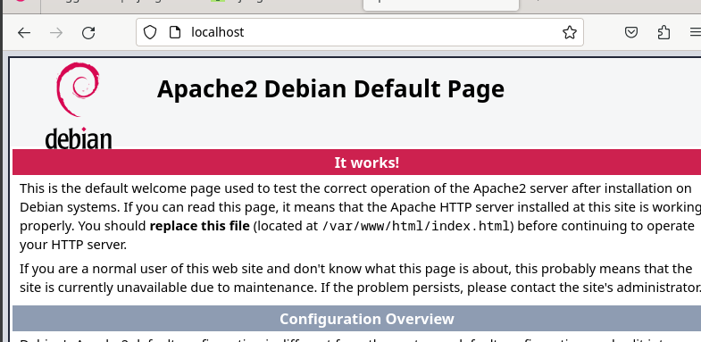 

Korvataan "default"-sivu 

    $ echo "Morjesta vaan"|sudo tee /var/www/html/index.html

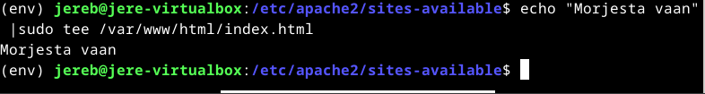 

Kuvasta näkyy, että sivu vastaa niin kuin pitää. 

Luodaan sisältöä sivulle käyttäjänä. Mennään kotihakemistoon ja luodaan hakemistoja sekä malli. 

    $ mkdir -p publicwsgi/jerebjo/static/

Kokeillaan toimiiko: 

    $ echo "Nähdään sivulla"|tee publicwsgi/jerebjo/static/index.html

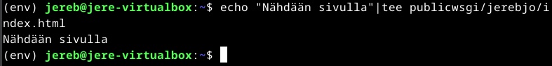 

`echo`-komento vastaa joten sivun pitäisi toimia. 

Lisätään uusi `Virtual Host` sudolla. 

    $ sudoedit /etc/apache2/sites-available/jerebjo.conf

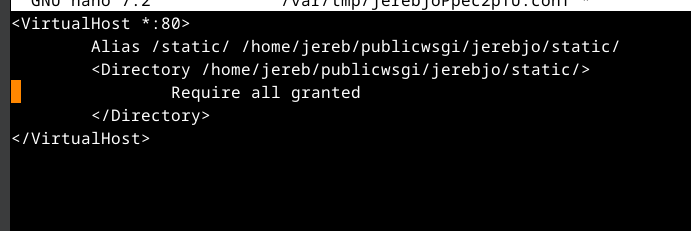 

Laitetaan uusi webbisivu päälle: 

    $ sudo a2ensite jerebjo.conf
    
    $ sudo a2dissite 000-default.conf 

Kokeillaan toimiiko konfiguraatio ennen käyttöä.

    $ /sbin/apache2ctl configtest

Syntaksi oli ok, joten pitäisi toimia. 

Katsotaan vielä onko meillä oikeudet static-tiedostoon: 

    $ curl http://localhost/static/

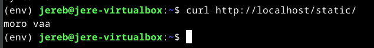 

Hyvältä näyttää sivu vastaa niin kuin pitää. 

### Djangon lataus virtualenvissä. klo.15.26.

Luodaan uusi virtualenv. 

    $ sudo apt-get -y install virtualenv

    $ cd publicwsgi/

    $ virtualenv -p python3 --system-site-packages env

Ladataan Django virtualenviin.

    $ source env/bin/activate

Tarkastetaan, että paketin asentaja `pip` on `env`-hakemistosta.

     $ which pip

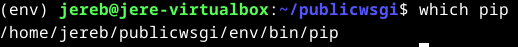 

Laitetaan django erilliseen tekstitiedostoon ja laitetaan sinne `django==4.0.2`: 

    $ micro requirements.txt

Ladataan django:

    $ pip install -r requirements.txt

Tarkistetaan vielä versio:

    $ django-admin --version

Jos vastaukseksi tulee `4.0.2` se on onnistunut.

### uusi Django-projekti. klo.15.41.

Aloitetaan uusi projekti.

    $ django-admin startproject jerebjo

Muokataan virtual host- tiedostoa.

    $ sudoedit /etc/apache2/sites-available/jerebjo.conf

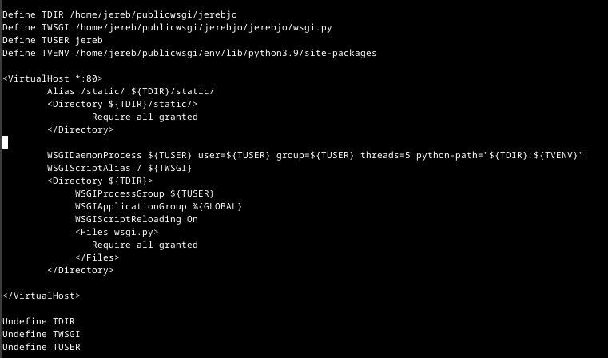 

 Asennetaan apachen wsgi moduuli. 

     $ sudo apt-get -y install libapache2-mod-wsgi-py3

Tarkistetaan syntaksi:

    $ /sbin/apache2ctl configtest

`SYNTAX ok` 

Käynnistetään apache2 uudelleen:

    $ sudo systemctl restart apache2

Tarkistetaan vielä, sivun toiminta.

    $ curl -s localhost|grep title

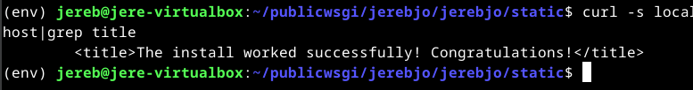

Tarkistetaan vielä onko se apache. 

    $ curl -sI localhost|grep Server

Sain `Apache/2.4.57 (Debian)` eli toimii. 

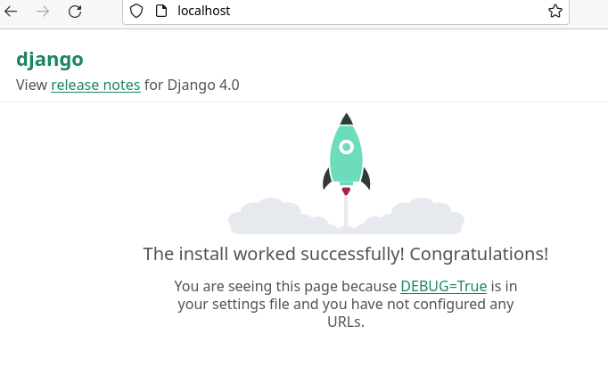 

### Disable debug klo. 16.31.

    $ cd

Hakemistojen kanssa oli aiemmin hiukan säätöä...

    $ cd publicwsgi/jerebjo/jerebjo/jerebjo/
    
    $ micro settings.py 

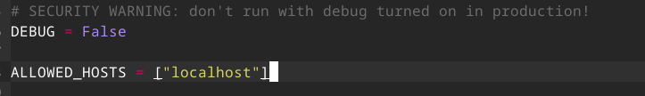

Päivitetään vielä tiedosto:

    $ touch wsgi.py

Käynnistetään apache uudelleen.

    $ sudo systemctl restart apache2

Tarkastetaan mitä sivu sanoo.

    $ curl -s localhost|grep title

Sivu antaa "Not found" koska sinne ei ole määritetty mitään.

### CSS lisäys. 

Mennään taas asetuksiin 

    $ cd
    $ cd publicwsgi/jerebo/jerebo/jerebo/
    $ micro settings.py

Lisätään asetuksiin seuraava kohta: 

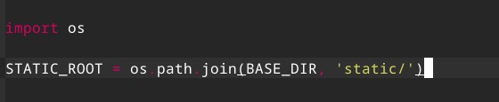 

Seuraavaksi: 

    $ ./manage.py collectstatic

Valitaan `yes`.

Tarkistetaan vielä tuliko tyylin muutos voimaan. 

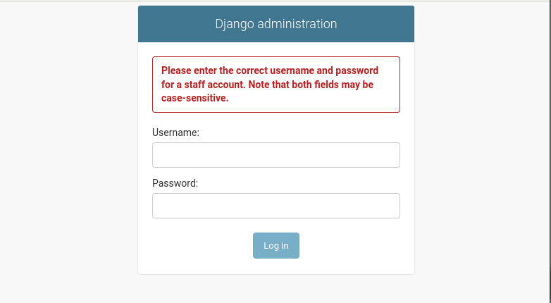 

## Lähteet

Karvinen, T. 27.2.2024. Luento

Karvinen, T. 27.2.2024. h6 DJ ango. https://terokarvinen.com/2024/linux-palvelimet-2024-alkukevat/#h6-dj-ango 

Karvinen, T.26.9.2023. Deploy Django 4 - Production Install https://terokarvinen.com/2022/deploy-django/ 

Karvinen, T. 13.2.2022. Django 4 Instant Customer Database Tutorial https://terokarvinen.com/2022/django-instant-crm-tutorial/ 

