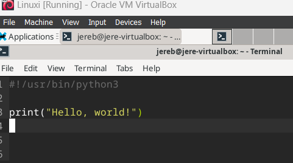
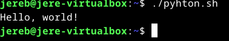
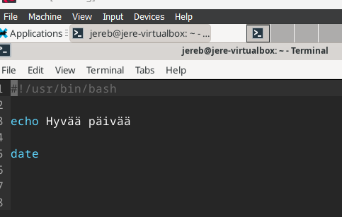
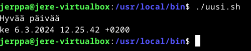

# H7 Maalisuora

## Käyttöympäristö

Prosessori: AMD Ryzen 5 5500H

RAM: 8 GB DDR4

Näytönohjain: NVIVIA GeForce RTX 2050

Käyttöjörjestelmä: Windows 10

## a) Hei maailma. klo. 11.14.

Tehtävän tarkoituksena on kääntää "hei maailma" haluamallani kielellä. Valitsin kieleksi pythonin sillä, se on minulle tutuin. Tehtävässä käytin [ChatGPT](https://chat.openai.com/) apua selvittääkseni, mitä tietyt komennot tarkoittavat

Tehtävää varten täytyi ladata python ja se onnistuu komennolla:

    sudo apt-get install python3

Olen myös ladannut micro-tekstieditorin, sillä pidän se on mielestäni hyvä. 

    sudo apt-get install micro

Seuraavaksi loin uuden tiedoston microon, johon teen python-ohjelmani. 

    micro python.sh

Lisäsin microon "shebang"-komennon, joka siis kertoo käyttöjärjestelmälle mitä ohjelmaa käyttää suorittaakseen tiedoston. Lisäsin myös itse python komennon minkä sen tulee suorittaa. 

 

Testasin vielä toimiiko komento kun ajan `./python.sh`

Huomasin, että komentoa ei voinut suorittaa, joten selvitin ongelman ja huomasin, että tiedosto ei ollut suoritettavissa, joten annoin seuraavan komennon:

    chmod +x python.sh

Sitten kokeilin uudelleen komentoa `./python.sh` ja se toimi. Komentotulkki tulosti juuri luodun ohjelmani. 

 

## Uusi komento linuxiin. klo. 11.51.

Tehdään linuxiin uusi komento, jotta kaikki käyttäjät voivat ajaa sitä.

Aloitin tekemällä uuden micro tiedoston `micro uusi.sh`

Sinne lisäsin seuraavat tiedot:

 

Seuraavaksi annoin oikeudet, jotta muutkin kaikki käyttäjät voivat käyttää sitä:

    chmod ugo+rx uusi.sh

Halusin vielä testata toimiiko se muilla käyttäjillä. Ensin siirsin tiedostoni `sudo cp uusi.sh /usr/bin/local/ `. Loin myös uuden käyttäjän:

    sudo adduser jerppa

Täytin käyttäjän tiedot ja kirjauduin käyttäjälle: 

    su - jerppa

Seuraavaksi kokeilin toimiiko komento `./uusi.sh`:

 

## c) 
