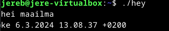

# H7 Maalisuora

## Käyttöympäristö

Prosessori: AMD Ryzen 5 5500H

RAM: 8 GB DDR4

Näytönohjain: NVIVIA GeForce RTX 2050

Käyttöjörjestelmä: Windows 10

## a) Hei maailma. klo. 11.14.

Tehtävän tarkoituksena on kääntää "hei maailma" haluamallani kielellä. Valitsin kieleksi pythonin sillä, se on minulle tutuin. Tehtävässä käytin [ChatGPT](https://chat.openai.com/) apua selvittääkseni, mitä tietyt komennot tarkoittavat

Tehtävää varten täytyi ladata python ja se onnistuu komennolla:

    sudo apt-get install python3

Olen myös ladannut micro-tekstieditorin, sillä pidän se on mielestäni hyvä. 

    sudo apt-get install micro

Seuraavaksi loin uuden tiedoston microon, johon teen python-ohjelmani. 

    micro python.sh

Lisäsin microon "shebang"-komennon, joka siis kertoo käyttöjärjestelmälle mitä ohjelmaa käyttää suorittaakseen tiedoston. Lisäsin myös itse python komennon minkä sen tulee suorittaa. 

 

Testasin vielä toimiiko komento kun ajan `./python.sh`

Huomasin, että komentoa ei voinut suorittaa, joten selvitin ongelman ja huomasin, että tiedosto ei ollut suoritettavissa, joten annoin seuraavan komennon:

    chmod +x python.sh

Sitten kokeilin uudelleen komentoa `./python.sh` ja se toimi. Komentotulkki tulosti juuri luodun ohjelmani. 

 

## Uusi komento linuxiin. klo. 11.51.

Tehdään linuxiin uusi komento, jotta kaikki käyttäjät voivat ajaa sitä.

Aloitin tekemällä uuden micro tiedoston `micro uusi.sh`

Sinne lisäsin seuraavat tiedot:

 

Seuraavaksi annoin oikeudet, jotta muutkin kaikki käyttäjät voivat käyttää sitä:

    chmod ugo+rx uusi.sh

Halusin vielä testata toimiiko se muilla käyttäjillä. Ensin siirsin tiedostoni `sudo cp uusi.sh /usr/bin/local/ `. Loin myös uuden käyttäjän:

    sudo adduser jerppa

Täytin käyttäjän tiedot ja kirjauduin käyttäjälle: 

    su - jerppa

Siirryin hakemistoon `cd /usr/bin/local` ja kokeilin toimiiko komento `./uusi.sh`:

 

Komento näytti toimivan niin kuin pitää. 

## c) Vanha arvioitava labra soveltuvin osin. klo. 12.32.

Tehtävän tarkoituksena on ratkaista vanha laboratiorioharjoitus soveltuvin osin. Tässä tehtävässä käytin [Final Lab for Linux Palvelimet 2023](https://terokarvinen.com/2023/linux-palvelimet-2023-arvioitava-laboratorioharjoitus/?fromSearch=laboratorioharjoitus)

### hey klo. 13.09

Loin uuden tekstitiedoston microlla nimeltä `hey`

Microon kirjoitin seuraavat tiedot:

 

Seuraavaksi annoin sille suoritusoikeudet `chmod +x hey`

Lopuksi suoritin komennon `./hey` ja kokeilin toimiiko ohjelma. 

 

Lisin myös oikeudet, että sitä voi käyttää kaikilla käyttäjillä.

     chmod ugo+rx hey

### staattisesti sinun klo. 13.16-15.04

Asensin apachen webbipalvelimen komennolla:

    sudo apt-get -y install apache2

Seuraavaksi piti luoda käyttäjään uusi käyttäjä "Erkki Esimerkki". 

    sudo adduser erkki

Otin salasana ylös jotta voin antaa sen käyttäjälle myöhemmin.

Annoin erkille sudo-oikeudet komennolla:

    sudo adduser erkki sudo

Kirjauduin sisään uudelle käyttäjälle:

    su - erkki

Seuraavaksi tein Erkille uuden kotisivun.

Esin loin kotihakemistoon uuden kansion `mkdir publicsites`.

`publicsites`-kansion sisään loin `erkki.com` kansion ja sen sisään loin microlla index.html-tiedoston.

Siirryin myös `cd etc/apache2/sites-available` ja loin sinne `erkki.conf` johon tein Name based virtualhost pohjan: 

 

Lisäsin `index.html`-tiedostoon hieman tekstiä ja testasin toimiiko sivu.

Ensin tietenkin laitoin sivun päälle. `sudo a2ensite erkki.conf`

Kokeilin selaimessa toimiiko localhost osoite. 

 

### Salattua hallintaa 7.3.2024. klo. 10.36

Aloitin asentamalla ssh palvelimen.

    sudo apt-get -y install ssh

Loin uuden käyttäjän tehtävää varten:

    sudo adduser jeretest

Lisätään uudelle käyttäjälle ssh-avain.

    ssh jeretest@localhost

    ssh-keygen

Kopoidaan vielä ssh-avain pääkäyttäjälle:

    ssh-copy-id jeretest@localhost

Kokeillaan vielä kirjautua ssh:n avulla käyttäjälle

     ssh jeretest@localhost

Kirjautuminen onnistui.

### Djangon lahjat klo. 10.52.

Tehtävän tekemiseen tarvitaan `virtualenv`, joten asensin sen ensin. 

    sudo apt-get -y install virtualenv

Luodaan uusi kansio `env/`

     virtualenv --system-site-packages -p python3 env/

Aktivoin virtuaaliympäristön:

    $ source env/bin/activate

Varmistetin vielä, että asennus tulee virtuaaliympäristöön

     which pip

 

    

    

    

